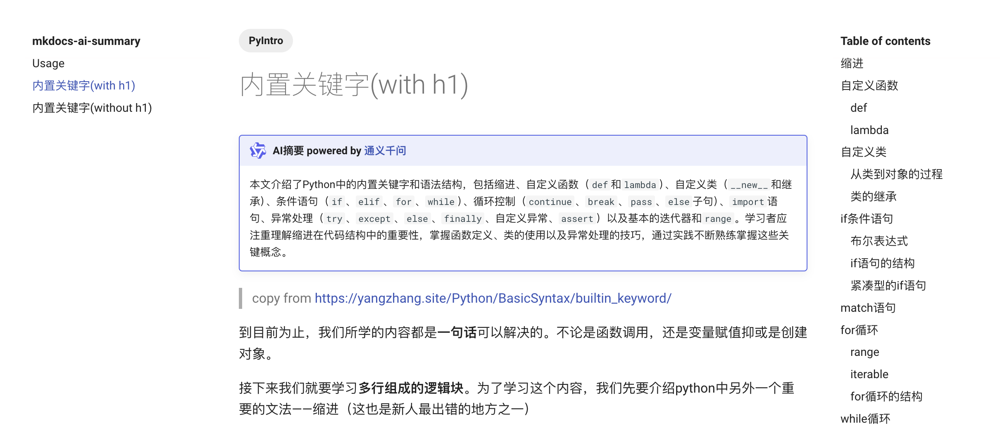

# mkdocs-ai-summary

[](https://pypi.org/project/mkdocs-ai-summary/)


Generage an **ai-summary** for the page:


Minimal demo [aiboy996.github.io/mkdocs-ai-summary](https://aiboy996.github.io/mkdocs-ai-summary)

Live demo(my homepage): [yangzhang.site](https://yangzhang.site)

## Installation

You should install the package with pip:
```
pip install mkdocs-ai-summary[tongyi]
```

> Only support [tongyi ai](https://tongyi.aliyun.com/) for now. **Soon to support ChatGPT.**

And you should include the [ai-summary.css](./docs/ai-summary.css)(optional, this is for the **custom admonition style**) in the config file as below:

## Configuration

A demo for `mkdocs.yml`:

```yml
site_name: mkdocs-ai-summary
theme:
  name: material

plugins:
  - ai-summary:
      api: "tongyi"
      ignore_code: true
      cache: true
      cache_dir: "./"
      prompt: "请帮我把下面的内容总结为200字以内的摘要："
  - tags

markdown_extensions:
  - admonition
  - pymdownx.details
  - pymdownx.superfences
  - pymdownx.tabbed:
      alternate_style: true 
extra_css:
  - ai-summary.css
```

Then for each page you can add the ai-summary with a meta tag:
```markdown
---
include:
- ai-summary
---

# h1

....
```

# About Cache

Don't worry about duplicate api calls, we've made the cache function so that if you've done an ai-summary before and the content hasn't changed it will use the cache.

Enjoy it.