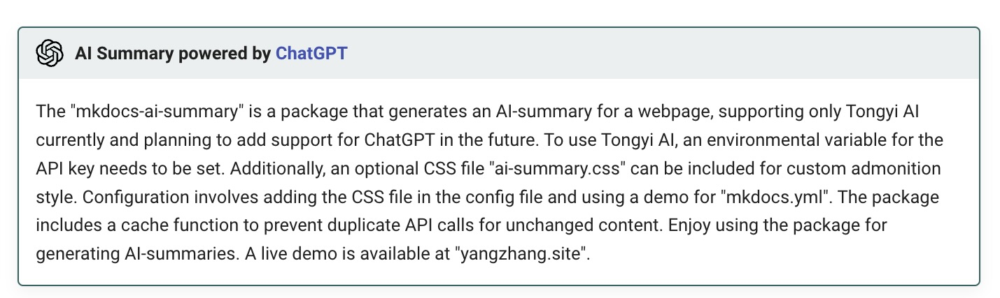

# mkdocs-ai-summary

[English](README_EN.md)

[](https://pypi.org/project/mkdocs-ai-summary/)


`mkdocs-ai-summary` 是一个 MkDocs 插件，可以为指定的 Markdown 页面生成 AI 摘要，并将摘要插入页面内容中。



## 在线示例

- 基于原生 MkDocs 的最小示例：[mkdocs-ai-summary-minimal-example](https://aiboy996.github.io/mkdocs-ai-summary-minimal-example/)
- MkDocs Material 示例：[项目演示站点](https://aiboy996.github.io/mkdocs-ai-summary)
- 实际使用案例：[yangzhang.site](https://yangzhang.site)

## 安装

根据要使用的服务商安装对应的 extra。ChatGPT 和 DeepSeek 使用 OpenAI Python SDK；通义千问使用 DashScope。

```bash
pip install 'mkdocs-ai-summary[chatgpt]'
# 或
pip install 'mkdocs-ai-summary[deepseek]'
# 或
pip install 'mkdocs-ai-summary[tongyi]'
```

在运行 `mkdocs build` 或 `mkdocs serve` 的环境中设置服务商 API Key：

```bash
export OPENAI_API_KEY="..."       # ChatGPT
export DEEPSEEK_API_KEY="..."     # DeepSeek
export DASHSCOPE_API_KEY="..."    # 通义千问
```

## 配置

在 `mkdocs.yml` 中启用插件。插件会在整个站点加载，但只有通过页面元数据启用 `ai-summary` 的页面才会请求生成摘要。

```yaml
plugins:
  - search
  - ai-summary:
      api: chatgpt
      ignore_code: true
      cache: true
      cache_dir: .
      prompt: "请用页面原文语言总结以下内容，摘要不超过 200 字："

extra_css:
  - ai-summary.css
```

然后在需要摘要的 Markdown 页面头部添加以下元数据：

```yaml
---
include:
  - ai-summary
---

# 页面标题

页面正文。
```

### 配置项

所有选项都可以在 `mkdocs.yml` 的 `plugins: - ai-summary:` 下配置，也可以在单个页面的 `ai-summary-config` 元数据中覆盖。页面级配置优先于站点级配置。

| 选项 | 类型 | 默认值 | 说明 |
| --- | --- | --- | --- |
| `api` | 字符串 | `chatgpt` | 服务商：`chatgpt`、`deepseek` 或 `tongyi`。 |
| `api_key` | 字符串 | 空字符串 | 对 `chatgpt` 和 `deepseek`，这里填写**环境变量名**，不是密钥本身，例如 `OPENROUTER_API_KEY`。留空时使用下表中的默认环境变量。通义千问通过 DashScope 读取 `DASHSCOPE_API_KEY`。 |
| `base_url` | 字符串 | 见下表 | OpenAI 兼容接口地址，仅 `chatgpt` 和 `deepseek` 使用。通义千问不使用此选项。 |
| `provider_name` | 字符串 | 见下表 | 摘要提示框的 CSS 类名前缀。插件会追加 `-summary`；例如 `openrouter` 会生成 `openrouter-summary`。 |
| `provider_title` | 字符串 | 见下表 | 摘要署名中显示的服务商名称。 |
| `provider_link` | 字符串 | 见下表 | 摘要署名对应的链接地址。 |
| `model` | 字符串 | 见下表 | 所选服务商支持的模型标识。 |
| `ignore_code` | 布尔值 | `true` | 是否从待总结内容中排除三反引号代码块。 |
| `cache` | 布尔值 | `true` | 页面内容未变化时是否复用已有摘要缓存。 |
| `cache_dir` | 字符串 | `./` | 缓存 JSON 文件的保存目录，相对于运行 MkDocs 时的当前工作目录。 |
| `prompt` | 字符串 | 见下方说明 | 添加在页面正文前的提示词。 |

默认提示词为 `Please help me summarize the following content into an abstract within 200 words:`。如果自定义提示词末尾没有冒号，插件会在提示词和正文之间补一个冒号。

下表汇总各 provider 的模型、密钥环境变量、接口地址和署名默认值。模型可用性可能变化，请按账户支持情况设置 `model`。

| `api` | 默认 `model` | `api_key` 留空时读取 | 默认/有效 `base_url` | 默认署名（`provider_name`；`provider_title`；`provider_link`） |
| --- | --- | --- | --- | --- |
| `chatgpt` | `gpt-3.5-turbo` | `OPENAI_API_KEY` | OpenAI SDK 默认地址 | `chatgpt`；`ChatGPT`；`https://chat.openai.com/` |
| `chatgpt` + 自定义 `base_url` | `gpt-3.5-turbo` | `OPENAI_API_KEY`，或由 `api_key` 指定 | 配置的 `base_url` | `custom-provider`；`Custom Provider`；配置的 `base_url` |
| `deepseek` | `deepseek-flash` | `DEEPSEEK_API_KEY` | `https://api.deepseek.com` | `deepseek`；`DeepSeek`；`https://www.deepseek.com/` |
| `deepseek` + 非默认 `base_url` | `deepseek-flash` | `DEEPSEEK_API_KEY`，或由 `api_key` 指定 | 配置的 `base_url` | `custom-provider`；`Custom Provider`；配置的 `base_url` |
| `tongyi` | `qwen-turbo` | `DASHSCOPE_API_KEY` | 不使用 | `tongyiai`；`通义千问`；`https://tongyi.aliyun.com/` |

每个 `provider_*` 选项都可以单独覆盖，站点级和页面级配置均可。例如，只修改 `provider_title` 时，自动选择的 CSS 类名和链接保持不变。`base_url` 不会自动识别实际服务商或品牌；自定义接口默认显示通用署名，可通过三个 `provider_*` 选项填写真实服务商信息。

### 选择服务商

使用通义千问时，将 `api` 设为 `tongyi`。模型和密钥默认值见上表：

```yaml
plugins:
  - ai-summary:
      api: tongyi
```

使用 DeepSeek 时，将 `api` 设为 `deepseek`。默认模型、接口地址和密钥环境变量见上表：

```yaml
plugins:
  - ai-summary:
      api: deepseek
```

也可以通过 `api: chatgpt` 使用 OpenRouter 等 OpenAI 兼容接口。`api_key` 填环境变量名，并提供该服务支持的接口地址和模型标识。下面示例显式设置了三项署名信息，因此摘要中会显示 OpenRouter，而不是自定义接口的通用署名：

```yaml
---
include:
  - ai-summary
ai-summary-config:
  api: chatgpt
  api_key: OPENROUTER_API_KEY
  base_url: https://openrouter.ai/api/v1
  model: YOUR_PROVIDER_MODEL_ID
  provider_name: openrouter
  provider_title: OpenRouter
  provider_link: https://openrouter.ai/
  prompt: "请用不超过 200 字总结本页面："
---
```

`api_key` 必须填写环境变量名。不要将 API 密钥直接写入 Markdown 或 `mkdocs.yml`。

### 样式

插件生成 MkDocs admonition。若要使用仓库内附带的 [ai-summary.css](docs/ai-summary.css)，请将其复制到文档目录，并在 `extra_css` 中引用，例如 `extra_css: [ai-summary.css]`。此样式为可选项，主要用于 Material 主题。

## 缓存

启用缓存后，摘要会以服务商对应的 JSON 文件保存在 `cache_dir` 中（默认是当前工作目录；目录不存在时会自动创建）。缓存条目按文章标题区分，并仅比较 `ignore_code` 处理后的 Markdown 正文 MD5（在添加提示词和服务商长度截断之前计算）。提示词、模型、接口地址和其他配置本身不会使缓存失效；若要强制按新配置重新生成，请删除对应服务商的缓存文件。当 `ignore_code: true` 时，三反引号代码块会从参与 MD5 计算的内容中排除。缓存文件可能包含生成的摘要；若页面内容是私有的，请勿提交这些文件。

## 致谢

- [MkDocs](https://www.mkdocs.org/)
- [MkDocs Material](https://squidfunk.github.io/mkdocs-material/)
