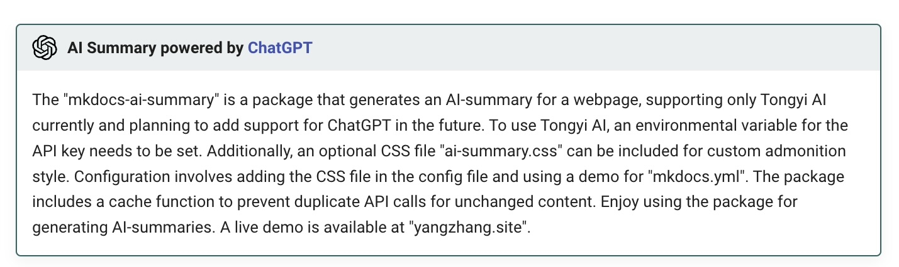

# mkdocs-ai-summary

[](https://pypi.org/project/mkdocs-ai-summary/)


Generage an **ai-summary** for the page:


Minimal demo: [aiboy996.github.io/mkdocs-ai-summary](https://aiboy996.github.io/mkdocs-ai-summary)

Live demo(my homepage): [yangzhang.site](https://yangzhang.site)

## Installation

You should install the package with pip:
```
pip install mkdocs-ai-summary[chatgpt]
```
or
```
pip install mkdocs-ai-summary[tongyi]
```
> ⚠️⚠️⚠️⚠️
> 
> Only support [ChatGPT](https://chat.openai.com/) and [tongyi ai](https://tongyi.aliyun.com/) for now.
>  
>  To use **ChatGPT(default)**, you should set a Environmental Variable for **api key**:
>  ```bash
>  export OPENAI_API_KEY='sk-xxxxxxx'
>  ```
> [how to get an OPENAI_API_KEY?](https://platform.openai.com/docs/quickstart)
> 
>  To use **tongyi ai**, you should set a Environmental Variable for **api key**:
>  ```bash
>  export DASHSCOPE_API_KEY='sk-xxxxxxx'
>  ```
> [how to get an DASHSCOPE_API_KEY?](https://dashscope.console.aliyun.com/)

[optional] Then you can include the [ai-summary.css](./docs/ai-summary.css)(optional, this is for the **custom  ai summary admonition style**) in the config file as below:

## Configuration

### Options can be set

name|type|default value| note
--|--|--|--
api|str|chatgpt| only support chatgpt or tongyi
model|str|gpt-3.5-turbo | -
ignore_code|bool|true| ignore code block in markdown
cache|bool|true| -
cache_dir|str|"./"| -
prompt|str|"Please help me summarize the following content into an abstract within 200 words: "| -


### For ChatGPT Summary

Setup `mkdocs.yml` like this:

```yml
site_name: mkdocs-ai-summary
theme:
  name: material

plugins:
  - ai-summary:
      api: "chatgpt"
      model: "gpt-3.5-turbo"
      ignore_code: true 
      cache: true
      cache_dir: "./"
      prompt: "Please help me summarize the following content into an abstract within 200 words: "
  - tags

markdown_extensions:
  - admonition
  - pymdownx.details
  - pymdownx.superfences
  - pymdownx.tabbed:
      alternate_style: true 
extra_css:
  - ai-summary.css
```

Then for the page you want an ai-summary, just add a meta tag:
```markdown
---
include:
- ai-summary
---

# title

hello ai summary.
```

### For tongyi ai Summary
or you can use **tongyi ai** by setting:
```yml
plugins:
  - ai-summary:
      api: "tongyi"
      model: "qwen-turbo"
      ignore_code: true
      cache: true
      cache_dir: "./"
      prompt: "Please help me summarize the following content into an abstract within 200 words: "
```

### Setup ai-summary for specific page

You can also setup ai summary for each page separately:

```markdown
---
include:
- ai-summary
ai-summary-config:
    api: "tongyi"
    model: "qwen-turbo"
    prompt: "帮我把下面的内容总结为200字以内的摘要："
---

# title

hello ai summary.
```

all config options are available. **Page configuration will override unified configuration.**

## About Cache

Don't worry about duplicate api calls, we've made the cache function so that if you've done an ai-summary before and the content hasn't changed it will use the cache.

Enjoy it.